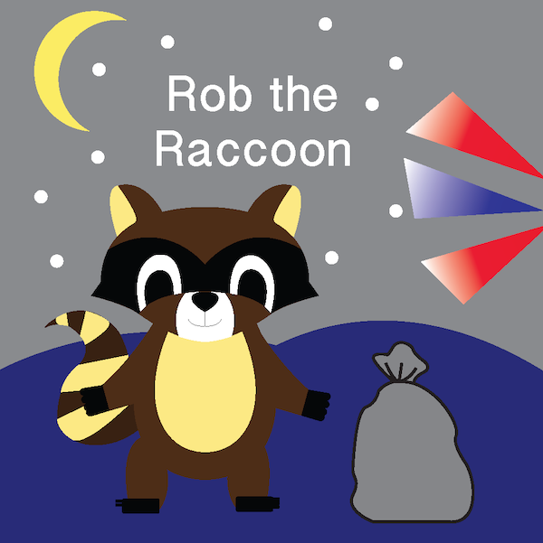

# Rob-The-Raccoon

## Description 

A simple webpage done in a graphic design class using javascript and jquery to create animations

## Usage
[Rob the Raccoon](https://zacharycampanelli.github.io/Rob-The-Raccoon/)

## License

A short and simple permissive license with conditions only requiring preservation of copyright and license notices. Licensed works, modifications, and larger works may be distributed under different terms and without source code.

## Questions

If you have any questions, concerns, or comments, feel free to contact me:

-GitHub: [Zacharycampanelli](https://github.com/Zacharycampanelli)  
-Email: [zaccamp@optonline.net](mailto:zaccamp@optonline.net)